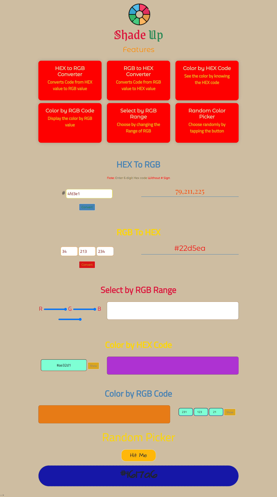

# Description
This is a collection of various ways of picking color and converting them using Javascript. This project includes color conversion from hex to rgb, rgb to hex, selecting color from range sliders, previewing color by hex codes and rgb. It also includes a random color picker.
## Time Taken

2 hour approximately

[Live Demo](https://shadeup-akj.netlify.app/)

### SnapShot of the program

